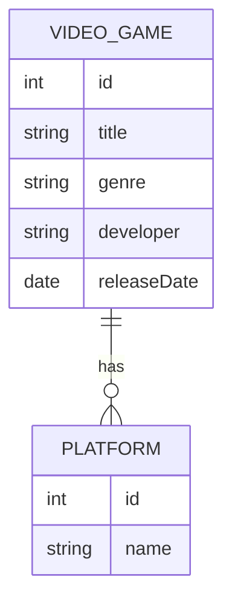

# 🎮 CRUD Symfony - Video Games (API REST)

Este projeto é uma aplicação CRUD (Create, Read, Update, Delete) desenvolvida com o framework **Symfony**, com foco no gerenciamento de uma lista de **video games**. A aplicação expõe uma API RESTful para cadastro, consulta, atualização e remoção de jogos eletrônicos.

---

## ✨ Funcionalidades

- ✅ Cadastrar novos video games via API  
- 📋 Listar todos os games cadastrados  
- 🔍 Visualizar detalhes de um game específico  
- ✏️ Atualizar informações de um game  
- 🗑️ Remover games do sistema  

---

## 🧱 Tecnologias utilizadas

- PHP (Symfony)
- Doctrine ORM
- PostgreSQL ou MySQL
- API Platform ou Controllers personalizados
- Composer
- PHPUnit (opcional)

---

## 🧩 Modelo de Dados (Mermaid)



---

## 🚀 Como executar

```bash
# Clone o repositório
git clone https://github.com/seu-usuario/video-games-crud-symfony.git
cd video-games-crud-symfony

# Instale as dependências
composer install

# Configure o banco de dados no .env.local

# Rode as migrations
php bin/console doctrine:migrations:migrate

# Inicie o servidor local
symfony server:start
```

---

## 📂 Organização

- `/src/Entity`:Contém as entidades do Doctrine, como VideoGame.php e Platform.php. Representam as tabelas do banco de dados.
- `/src/Repository`:Contém as classes responsáveis por acessar diretamente o banco de dados com consultas personalizadas (query builders, DQL, etc.). Ex: VideoGameRepository.
- `/src/Service`:Contém a lógica de negócio da aplicação (por exemplo: criação de um game, validações, regras específicas). Elas usam os repositórios internamente.
- `/src/Contract`: Define as interfaces para os serviços, facilitando a inversão de dependência e testabilidade. Ajuda a manter o desacoplamento entre controllers e serviços.
- `/src/Controller`: 	Camada de entrada da aplicação. Controladores expõem as rotas REST, recebem as requisições, delegam para o Service e retornam a resposta.
- `/migrations`: Armazena as classes geradas com doctrine:migrations:diff, que controlam e versionam alterações no banco de dados.

---

## 🧪 Testes

```bash
php bin/phpunit
```

---

## Desenvolvido por Vitor Gomes Guimarães 👨‍💻
